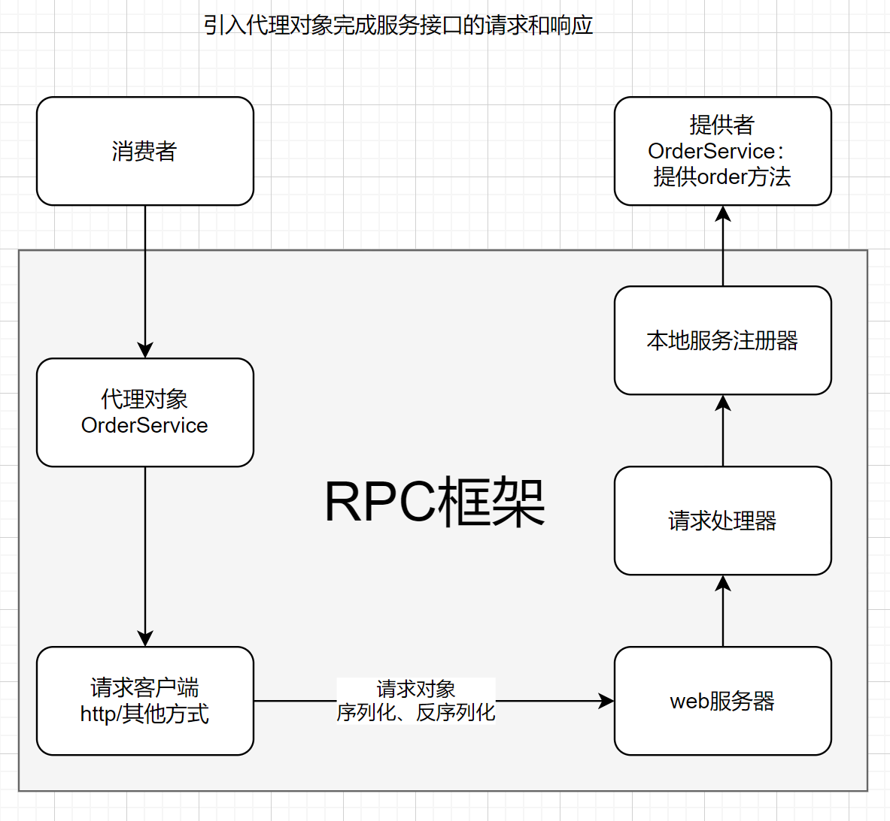
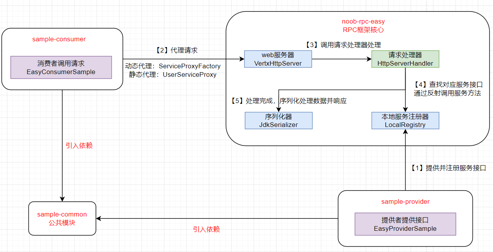
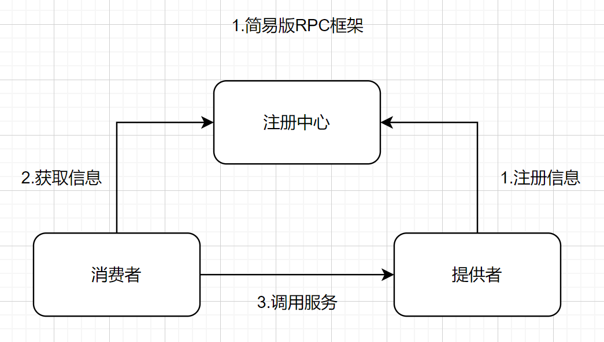
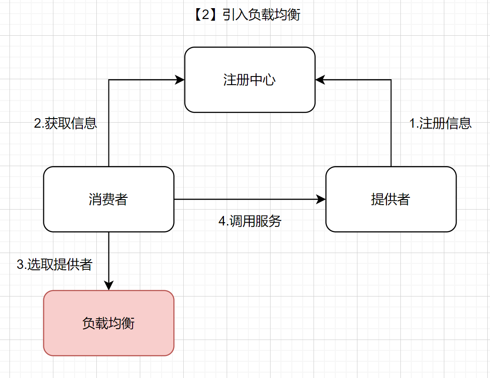
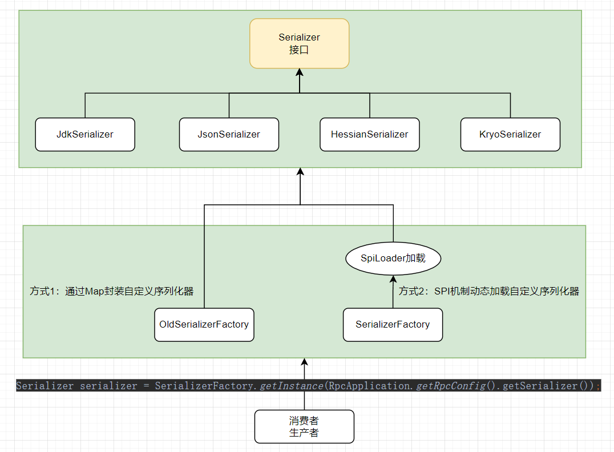
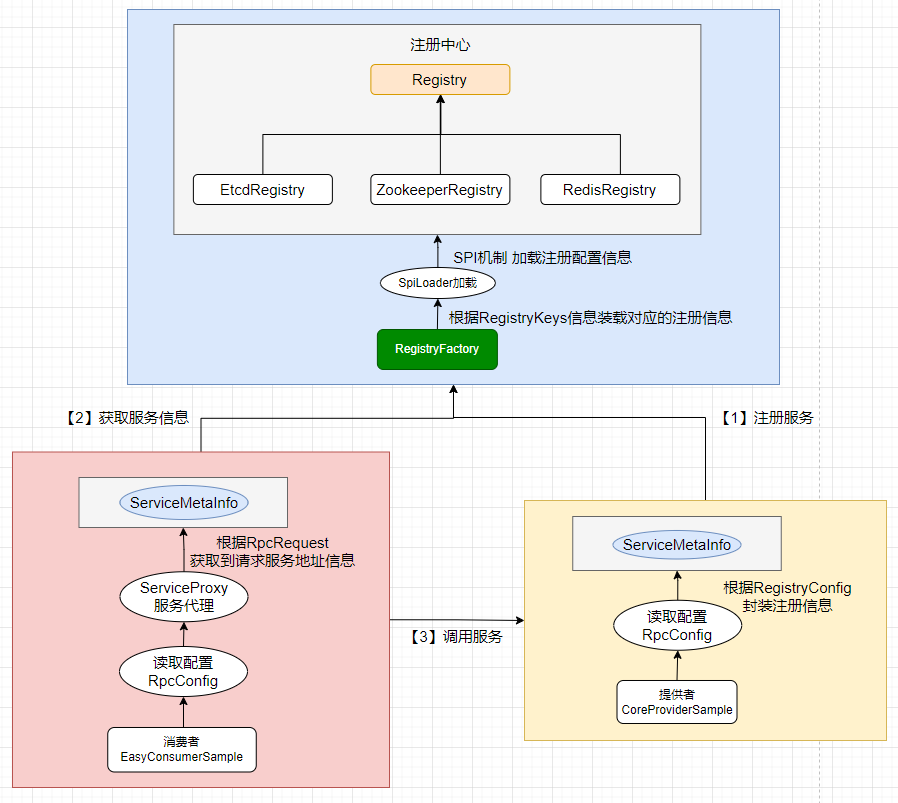
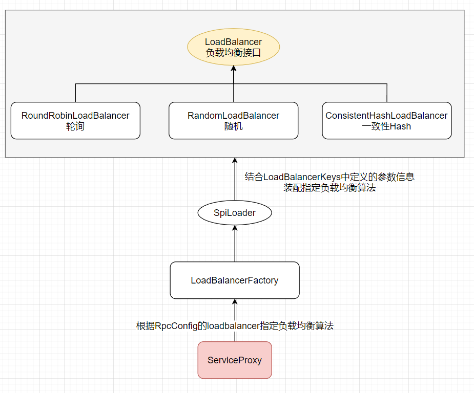
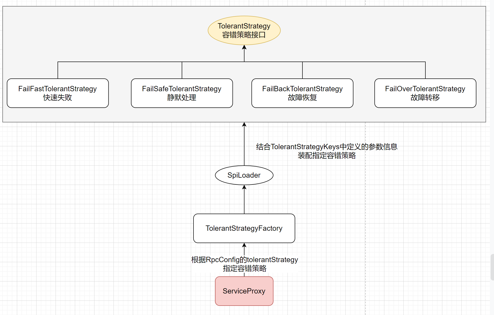
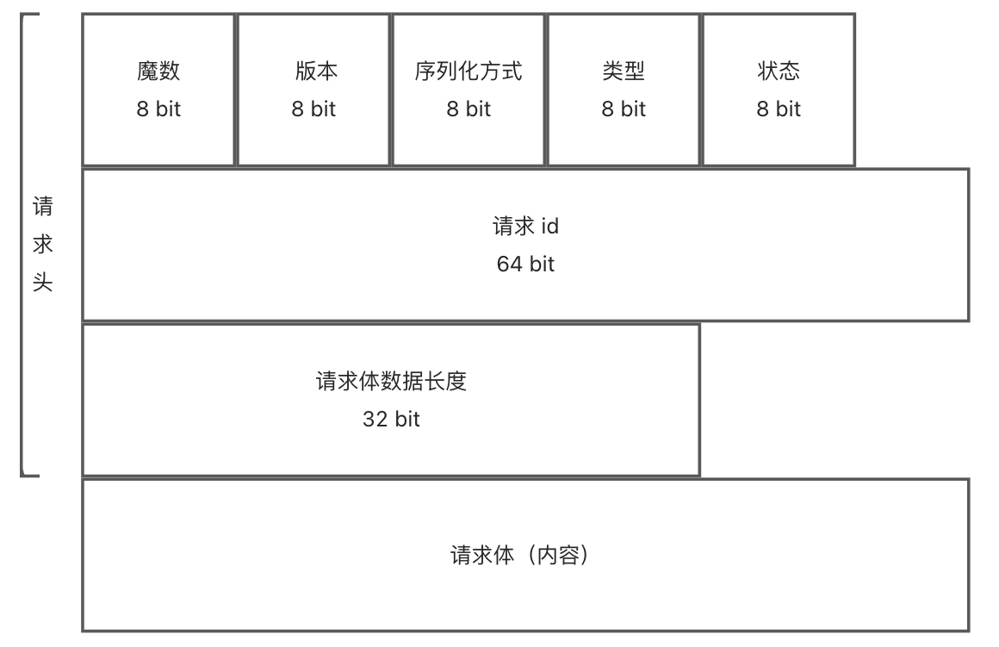

# noob-rpc
​	手写RPC框架：RPC框架学习、扩展（基础版RPC框架、扩展版PPC框架）

## RPC框架介绍

> 项目简介

​	基于 Java + Etcd + Vert.x 的高性能 RPC 框架，用新颖的技术栈从0到1开发轮子。学习并实践基于 Vert.x 的网络服务器、序列化器、基于 Etcd 和 ZooKeeper 的注册中心、反射、动态代理、SPI机制、自定义网络协议、多种设计模式(单例/工厂/装饰者等)、负载均衡器设计、重试和容错机制、SpringBoot Starter 注解驱动开发等，大幅提升架构设计能力。

​	项目分为基础版和扩展版：

​	基础版（基础RPC框架：实现服务注册和服务发现，完成业务流程调用）

​	扩展版（搭配业务项目使用，技术栈扩展：参考现有RPC框架设计，一步步完善RPC框架设计）


> 技术栈选型

后端技术以 Java 为主，但所有的思想和设计都是可以复用到其他语言的，掌握核心思路即可

- ⭐️ Vert.x 框架
- ⭐️ Etcd 云原生存储中间件（jetcd 客户端）
- ZooKeeper 分布式协调工具（curator 客户端）
- ⭐️ SPI 机制
- ⭐️ 多种序列化器
	- JSON 序列化
	- Kryo 序列化
	- Hessian 序列化
- ⭐️ 多种设计模式
	- 双检锁单例模式
	- 工厂模式
	- 代理模式
	- 装饰者模式
- ⭐️ Spring Boot Starter 开发
- 反射和注解驱动
- Guava Retrying 重试库
- JUnit 单元测试
- Logback 日志库
- Hutool、Lombok 工具库


>项目构建思路

【1】简易版RPC构建：实现服务注册和服务发现

【2】全局配置加载：引入RpcConfig全局配置

【3】接口MOCK：提供MOCK服务，用于调通业务流程（考虑扩展更多不同类型的MOCK）

【4】序列化器和SPI机制：SPI机制&工厂方法的结合使用，实现支持配置和自定义扩展接入

【5】注册中心基本实现&优化：基于etcd构建注册中心

【6】自定义协议： 自定义协议格式梳理、基于Vert.x的TCP实现（替换原有基于http的web服务）、解决半包/粘包问题

【7】负载均衡：引入负载均衡算法，减轻单个服务节点压力，由服务消费者根据配置算法选择服务节点

【8】重试机制：提供接口调用失败的重试策略

【9】容错机制：提供异常情况的容错策略（针对请求处理：先重试后容错）

【10】启动机制&注解驱动：基于springboot框架引入启动机制、注解驱动，实现类似Dubbo框架通过注解实现RPC框架应用

【11】RPC框架扩展：扩展思路构建，后续待完成

## RPC框架实现

### 1.基础版RPC框架构建

```properties
# 项目结构说明
noob-rpc(根目录)
sample-common(公共模块：公共依赖，包括接口、Model等内容)
sample-consumer(子模块：消费者)
sample-provider(子模块：提供者)
noob-rpc-easy(简易版RPC框架)
```

​	构建一个简化版的RPC框架，完成一个消费者请求调用的的过程




> 简易版RPC框架实现核心




### 2.扩展版RPC框架构建

#### 构建思路

> 服务注册和发现

​	消费者如何知道自己要调用的服务接口和参数请求呢？

​	可以通过提供一个服务注册中心存储服务提供者相关的一些信息（例如服务地址、服务方法信息等），一般现成的服务注册中心有redis、zookeeper等




> 负载均衡

​	如果存在多个服务提供者，消费者应该调用哪个服务提供者呢？

​	可以给服务调用方增加负载均衡能力，通过指定不同的算法来决定调用哪一个服务提供者，比如轮询、随机、根据性能动态调用等。




> 容错机制

​	如果服务调用失败该如何处理？


#### 构建步骤

```properties
# 项目结构说明
noob-rpc(根目录)
sample-common(公共模块：公共依赖，包括接口、Model等内容)
sample-consumer(子模块：消费者)
sample-provider(子模块：提供者)
noob-rpc-core：rpc框架核心代码

# 基于springboot应用自定义RPC框架
sample-springboot-consumer(子模块：消费者，基于springboot框架)
sample-springboot-provider(子模块：提供者，基于springboot框架)
noob-rpc-springboot-starter(注解驱动的RRC框架，可在sringboot框架中快速使用)
```

##### 【1】项目结构


##### 【2】全局配置加载

> 扩展核心

【1】引入全局配置（框架配置核心构建）

【2】构建RpcApplication加载全局配置


##### 【3】接口Mock

> 扩展核心

【1】Mock概念引入：类似模拟数据（针对一些开发场景下无法调通服务的情况，提供一些模拟服务响应数据模拟远程服务行为，便于开发流程调通）

【2】Mock实现：设定mock属性（确认框架是否开启mock模式），通过代理模式构建MockService


##### 【4】支持配置和扩展自定义实现（SPI机制&工厂模式组合应用）

> 扩展核心

【1】SPI机制&工厂模式概念引入

【2】使用SPI机制&工厂模式组合应用，实现支持配置和扩展自定义实现，参考**序列化器**、**注册中心**、**负载均衡**、**重试机制**、**容错机制**的构建

###### 序列化器（Json、Kryo、Hessian）




###### 注册中心

​	基于基础版本的注册中心目的在于做一件事情：将原有通过http请求硬编码调整为通过从注册中心获取服务信息进行调用的方式

【1】服务提供方根据配置将服务注册到注册中心

【2】服务调用方根据配置查询注册中心对应服务的注册信息，随后根据获取到的请求地址进行服务调用




###### 负载均衡

【1】负载均衡概念梳理、常见负载均衡算法

【2】引入轮询、随机、一致性Hash三种负载均衡算法

【3】自定义负载均衡器，提供扩展负载均衡器接口




###### 重试机制

【1】重试策略概念梳理、常见重试策略

【2】引入两种重试策略：不重试、固定时间间隔

【3】自定义重试策略接口定义，提供扩展重试策略


###### 容错机制

【1】容错机制概念、不同容错策略

【2】容错机制实现：定义容错策略接口、扩展不同的容错策略

【3】引入SPI机制和工厂模式：支持配置和自定义容错策略扩展




##### 【5】自定义协议

> 扩展核心

【1】自定义协议格式梳理（协议消息、相关协议数据字段枚举）

【2】基于Vert.x的TCP实现（参考基于Vert.x的HTTP实现思路进行构建）：先从demo（server、client）理解TCP协议的请求响应，然后在RPC框架中引入（服务提供者：server引用自定义的TcpServerHandler；服务消费者在ServerProxy中按照TCP协议规则处理响应）

【3】解决半包、粘包问题：使用Vert.x的RecordParse

【4】装饰者模式的场景应用：对半包、粘包方法进行封装（基于Handler进行装饰对buffer进行处理，引入TcpBufferHandlerWrapper）、修改ServiceProxy中TCP响应处理（将响应处理方法放在VertxTcpClient实现）




##### 【6】启动机制&注解驱动

> 开发扩展说明

【1】启动机制：提供 ProviderBootstrap、 ConsumerBootstrap分别作为服务提供者、服务消费者启动类，在项目中引用其初始化RPC框架

【2】注解驱动：引入自定义注解，实现类似Dubbo框架应用的注解配置：@EnableRpc、@RpcService、@RpcReference

【3】构建sample-springboot-provider、sample-springboot-consumer引入starter，使用注解配置完成RPC框架应用

​	基于springboot框架优化RPC框架使用，引入启动机制&注解驱动概念，简化RPC框架的使用。可以实现类似Dubbo框架中的注解引用


## 框架扩展

> 扩展思路

 【1】RPC 请求类中支持携带参数列表，可用于安全校验等

​	参考思路:比如服务提供者参数列表、服务消费者参数列表，服务端收到请求后可以根据参数列表中的值，判断如何进一步处理，比如在参数列表中携带 token 可以实现安全校验。

【2】开发服务管理界面。

​	参考思路:类似 Nacos 注册中心面板，需要一定的前端基础

【3】项目支持读取 yml/yaml 等更多类型的配置文件，作为全局配置。

​	参考思路:仿照现有的 ConfigUtils 工具类，支持更多读取配置的方式，甚至可以使用 SPI 机制允许开发者二次扩展配置解析器。

【4】实现拦截器机制，服务调用前和服务调用后可以执行额外的操作

​	参考思路:可以参考 Soring MVC 或 Servlet 的 Filter 机制，使用责任链模式实现;可以在服务提供者处理前后、服务消费者调用前后增加拦截器，用于进行日志校验、安全校验等。还可以使用 SP1 机制，支持用户自定义拦截器

【5】自定义异常

​	参考思路:自定义异常类 RpcException，根据业务区分错误码(ErrorCode)，比如消费者异常、注册中心异常、提供者异常等，让报错更清晰明确

【6】服务支持指定版本号

​	参考思路:虽然目前框架已经预留了版本字段，但都是默认值 1.0，还需要从服务提供者、再到消费者代理调用的一条完整路径上去应用版本号

【7】支持消费方指定某个服务级别的负载均衡器、重试策略、容错机制

​	参考思路:目前只能通过全局配置改变对所有服务的负载均衡调用规则。实现的话可能需要修改 ServiceProxy 类，让它支持传参，根据消费端的配置来动态创建 ServiceProxy

【8】支持指定服务分组:服务提供者能够选择服务的分组，服务消费者能够使用指定分组的服务。(Dubbo 支持)
参考思路:目前框架仅仅是预留了服务分组字段，用默认值填充。还需要从服务提供者、再到消费者代理调用的一条完整路径上去应用服务分组。可以进一步实现多环境功能

【9】服务消费方支持设定超时时间

​	参考思路:可以通过修改 TCP 客户端请求相关的代码实现

【10】处理 Bean 注入问题:目前本地服务注册表存储的是 class，然后通过反射创建实例，但是如果 Bean 包含有参构造函数，或者给属性注入了其他示例，这种方式就行不通了

​	参考思路:本地注册时要放入实现类的对象实例，而不是 class 类型。


> 项目开发笔记&常见问题总结梳理

【1】简易版RPC构建

【2】扩展版RPC-全局配置加载

【3】扩展版RPC-接口Mock

【4】扩展版RPC-序列化器与SPI机制

【5】扩展版RPC-注册中心实现和优化

【6】扩展版RPC-自定义协议

【7】扩展版RPC-负载均衡

【8】扩展版RPC-重试机制

【9】扩展版RPC-容错机制

【10】扩展版RPC-启动机制和注解驱动

